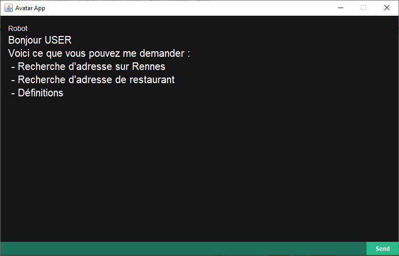
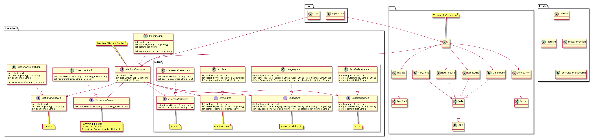
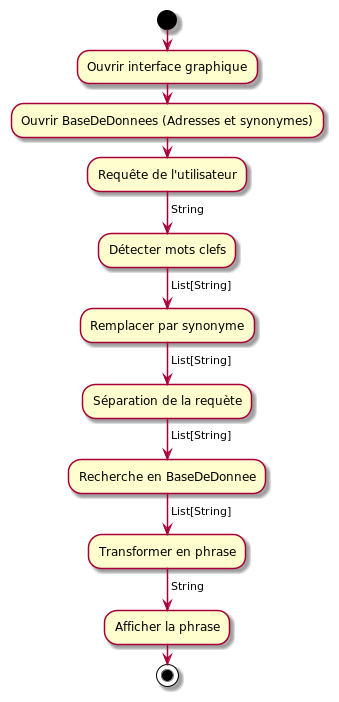
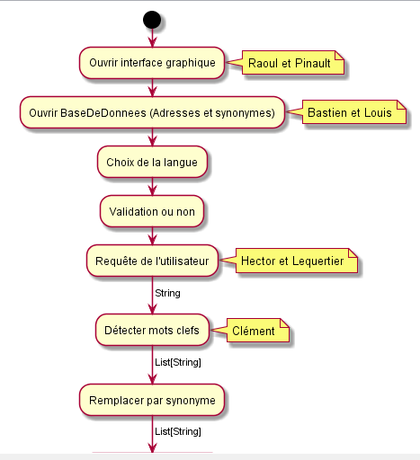

# GEN - TP Avatar

## Screenshot



## Description
Ce projet est un robot intéractif permettant de demander l'adresse d'un lieu se situant dans la ville de Rennes.

[Présentation diapo](./doc/Présentation_projet_avatar_G5J2.pdf)

## Utilisation
- Exécutez _**client.Application**_
- Entrez votre demande
```
- Où se trouve la Mairie de Rennes ?
- Bonjour, puis-je avoir l'adresse de la Gare ?
- Bonjour, je voudrais la localisation de la mairie et du TNB.
```
- Cliquez sur _**send**_

## Fonctionnalités
### Changemement de Langue
Vous pouvez changer la langue en écrivant un mot de recherche ou bonjour
```
USER : Hello
ROBOT : Do you speak english ?
USER : Yes
ROBOT : Okay, what is your query ?
USER : je cherche une piscine
ROBOT : Parlez-vous Fraçais ?
```
### Recherche en base de donnée locale
Un fichier Base de Donnée est présent dans le Projet. Une simple requête permet de recherche une adresse.
```
USER : Bonjour, je cherche le tnb
ROBOT : Bonjour
ROBOT : L'adresse du Théâtre National de Bretagne est ...
USER : Mairie de Rennes
ROBOT : L'adresse de la Mairie de Rennes est : ...
```

### Recherche dans le XML
Un fichier XML contient plus d'informations sur les adresses. Dans le cas où plusieurs réponses, l'utilisateur peut choisir.
```
USER : Je cherche une piscine
ROBOT : J'ai 4 réponses possibles
ROBOT : 1) ...
ROBOT : 2) ...
ROBOT : 3) Piscine de Bréquigny
ROBOT : 4) ...
USER : la 3
ROBOT : L'adresse de la Piscine de Bréquigny est : ...
```

### Recherche dans le dictionnaire
Une requête à l'API du dicitonnaire Google (non-officielle) est possible pour chercher des mots dans le dicitonnaire en fonction de la langue utilisée.  
Lien de l'API : https://dictionaryapi.dev/


### Recherche sur l'internaute
Si l'utilisateur recherche un restaurant, une pizzeria ou une crêperie, le robot recherche les adresses sur le site de l'Internaute.  
Lien vers le site de l'Internaute : https://www.linternaute.com/


## Documentation
[ScalaDoc](./doc/scaladoc/index.html)

## Membres
- [GOARDOU Fabien](https://fgdou.ovh)
- LEMANE Clement
- LEQUERTIER Thibaud
- MARCHAND Hector
- MORLOT-PINTA Louis
- PINAULT Guillaume
- RAOUL Thibaut
- SAUVAT Bastien

## Diagramme UML
Version 2.0 (cette version est la version active).  


## Workflow
Version 1.0 (cette version n'est plus active).  


Version 2.0 (cette version est active)


## Crédits
Les requêtes effectuées sur internet sont effectuées grâce au site de l'*Internaute* et du *dictionnaire de Google* (non-officiel).  
L'icône du programme est tirée du site www.flaticon.com et dûe à l'auteur Flat Icons.  


